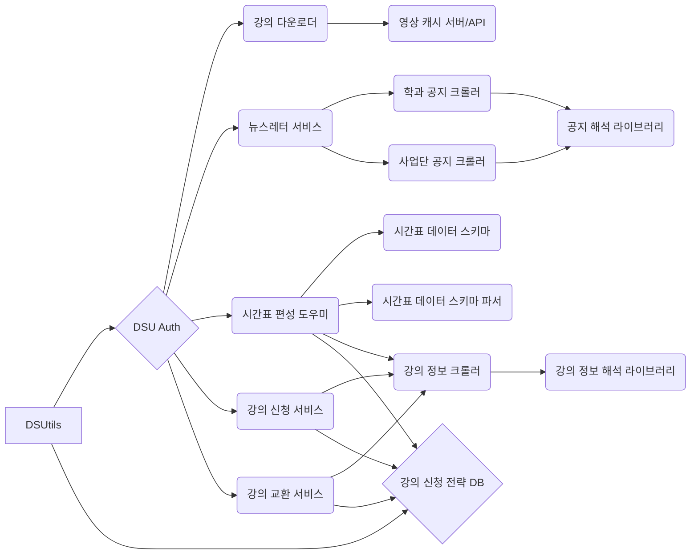

# DSUtils

동서대학교에서 사용할 수 있는 응용 프로그램을 제작하는 프로젝트

## Contents

- [프로젝트 구조도](#프로젝트-구조도)
- [강의 다운로더](#강의-다운로더)
- [DSU Auth](#dsu-auth)
- [뉴스레터 서비스](#뉴스레터-서비스)
- [시간표 편성 도우미](#시간표-편성-도우미)
- [강의 교환 서비스](#강의-교환-서비스)
- [강의 신청 서비스](#강의-신청-서비스)
- [강의 신청 DB](#강의-신청-db)

## 프로젝트 구조도

서비스 연결 구조와 서비스 별로 필요한 라이브러리/도구 정보를 엮어 만든 다이어그램입니다.

어떠한 형식이 아니라 임의로 작성한 것임을 유의하여 보시기 바랍니다.

## [강의 다운로더](./docs/project/downlaoder.md)

교내 이클래스에서 강의를 다운로드 할 수 있도록 지원하는 서비스입니다.

## DSU Auth

교내 이클래스, 학사행정서비스로 가는 계정 정보, 이메일, 전화번호 등을 저장하여 다른 서비스를 쉽게 사용할 수 있도록 돕는 서비스입니다.

일종의 소셜 로그인을 위한 서비스라고 할 수 있습니다.

## 뉴스레터 서비스

특정한 사업단, 학과의 공지를 이메일/카카오톡으로 보내주는 서비스인비다.

## 시간표 편성 도우미

매 학기 시간표 편성을 쉽게 할 수 있도록 돕는 서비스입니다.

시간표를 시각적으로 볼 수 있는 기능을 포함해서 시간 겹치는 강의 필터, 중복 강의 필터 등이 포함된 서비스입니다.

- 멀티 프로필 기능이 포함됩니다.

## 강의 교환 서비스

원하는 강의와 필요 없는 강의를 선택하면 서비스 사용자 간에 강의를 서로 교환할 수 있도록 지원하는 서비스입니다.

- 사용자 정의 기간 또는 수강 신청 기간 내에 상의 교환이 이루어지지 않으면 교환 신청이 해제됩니다.
- 남아 있는 강의를 자동으로 신청하는 기능은 `강의 신청 서비스`의 기능과 중복되는 기능으로, 해당 서비스는 비공개 서비스이기 때문에 관련 기능은 `강의 교환 서비스`에 포함되지 않습니다.

## 강의 신청 서비스

강의를 자동으로 신청해주는 서비스입니다.

- 비공개 서비스로 개발할 예정입니다.
- 시간표 편성 도우미의 시간표 데이터를 활용해 강의 신청을 더욱 수월하게 하는 기능이 포함됩니다. 멀티 프로필 데이터로 등록된 경우, 자동으로 분석 후 사용 가능한 시간표 프로필대로 강의를 신청하게 됩니다.
- 시간표 편성 도우미를 사용하지 않거나 모든 프로필이 신청 불가한 경우, 필요한 학점, 과목 분류, 선호 과목 등의 데이터를 별도로 지정하여 서비스가 자동으로 강의를 신청하도록 할 수 있습니다.

## 강의 신청 DB

사용자가 저장한 시간표 편성 정보, 강의 신청 시나리오를 저장하는 DB/API 입니다.
