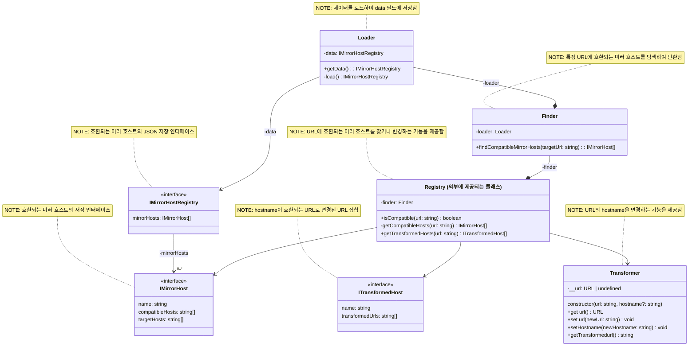

```mermaid
classDiagram
  class Loader {
    -data: IMirrorHostRegistry
    +getData(): IMirrorHostRegistry
    -load() IMirrorHostRegistry
  }

  class Finder {
    -loader: Loader
    +findCompatibleMirrorHosts(targetUrl: string): IMirrorHost[]
  }

  class Transformer {
    -__url: URL | undefined
    constructor(url: string, hostname?: string)
    +get url() URL
    +set url(newUri: string) void
    +setHostname(newHostname: string) void
    +getTransformedurl() string
  }

  class Registry["Registry (외부에 제공되는 클래스)"] {
    -finder: Finder
    +isCompatible(url: string) boolean
    -getCompatibleHosts(url: string) IMirrorHost[]
    +getTransformedHosts(url: string) ITransformedHost[]
  }

  class IMirrorHost {
    <<interface>>
    name: string
    compatibleHosts: string[]
    targetHosts: string[]
  }

  class IMirrorHostRegistry {
    <<interface>>
    mirrorHosts: IMirrorHost[]
  }

  class ITransformedHost {
    <<interface>>
    name: string
    transformedUrls: string[]
  }

  note for Loader "NOTE: 데이터를 로드하여 data 필드에 저장함"
  note for Finder "NOTE: 특정 URL에 호환되는 미러 호스트를 탐색하여 반환함"
  note for Transformer "NOTE: URL의 hostname을 변경하는 기능을 제공함"
  note for Registry "NOTE: URL에 호환되는 미러 호스트를 찾거나 변경하는 기능을 제공함"

  note for IMirrorHost "NOTE: 호환되는 미러 호스트의 저장 인터페이스"
  note for IMirrorHostRegistry "NOTE: 호환되는 미러 호스트의 JSON 저장 인터페이스"
  note for ITransformedHost "NOTE: hostname이 호환되는 URL로 변경된 URL 집합"

  Loader --> IMirrorHostRegistry: -data
  Loader --* Finder: -loader
  IMirrorHostRegistry --> "0..*" IMirrorHost: -mirrorHosts

  Finder --* Registry: -finder

  Registry --> IMirrorHost
  Registry --> ITransformedHost
  Registry --> Transformer
```
