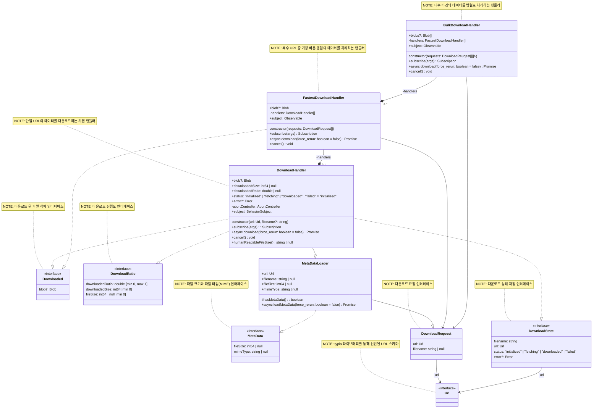

```mermaid
classDiagram
  class MetaData {
    <<interface>>
    fileSize: int64 | null
    mimeType: string | null
  }

  class Downloaded {
    <<interface>>
    blob?: Blob
  }

  class Url {
    <<interface>>
  }

  class DownloadRequest {
    url: Url
    filename: string | null
  }


  class DownloadState {
    <<interface>>
    filename: string
    url: Url
    status: "initialized" | "fetching" | "downloaded" | "failed"
    error?: Error
  }
  class DownloadRatio {
    <<interface>>
    downloadedRatio: double [min 0, max 1]
    downloadedSize: int64 [min 0]
    fileSize: int64 | null [min 0]
  }

  class MetaDataLoader {
    +url: Url
    +filename: string | null
    +fileSize: int64 | null
    +mimeType: string | null

    #hasMetaData(): boolean
    +async loadMetaData(force_rerun: boolean = false) Promise<void>
  }

  class DownloadHandler {
    +blob?: Blob
    +downloadedSize: int64 | null
    +downloadedRatio: double | null
    +status: "initialized" | "fetching" | "downloaded" | "failed" = "initialized"
    +error?: Error

    -abortController: AbortController
    +subject: BehaviorSubject<DownloadRatio>

    constructor(url: Url, filename?: string)

    +subscribe(args): Subscription
    +async download(force_rerun: boolean = false) Promise<Blob>
    +cancel() void
    +humanReadableFileSize() string | null
  }

  class FastestDownloadHandler {
    +blob?: Blob
    -handlers: DownloadHandler[]
    +subject: Observable<number>

    constructor(requests: DownloadRequest[])

    +subscribe(args) Subscription
    +async download(force_rerun: boolean = false) Promise<Blob | undefined>
    +cancel() void
  }

  class BulkDownloadHandler {
    +blobs?: Blob[]
    -handlers: FastestDownloadHandler[]
    +subject: Observable<number[]>

    constructor(requests: DownloadReuqest[][]>)
    +subscribe(args) Subscription
    +async download(force_rerun: boolean = false) Promise<Blob[]>
    +cancel() void
  }

  note for MetaData "NOTE: 파일 크기와 파일 타입(MIME) 인터페이스"
  note for Downloaded "NOTE: 다운로드 된 파일 객체 인터페이스"
  note for Url "NOTE: typia 라이브러리를 통해 선언된 URL 스키마"
  note for DownloadRequest "NOTE: 다운로드 요청 인터페이스"
  note for DownloadState "NOTE: 다운로드 상태 저장 인터페이스"
  note for DownloadRatio "NOTE: 다운로드 진행도 인터페이스"

  note for DownloadHandler "NOTE: 단일 URL의 데이터를 다운로드하는 기본 핸들러"
  note for FastestDownloadHandler "NOTE: 복수 URL 중 가장 빠른 응답의 데이터를 처리하는 핸들러"
  note for BulkDownloadHandler "NOTE: 다수 타겟의 데이터를 병렬로 처리하는 핸들러"

  DownloadRequest --> Url: -url
  DownloadState --> Url: -url

  MetaDataLoader ..|> MetaData
  MetaDataLoader --|> DownloadRequest
  DownloadHandler --|> MetaDataLoader
  DownloadHandler ..|> DownloadRatio
  DownloadHandler ..|> Downloaded
  DownloadHandler ..|> DownloadState
  FastestDownloadHandler --> DownloadRequest
  FastestDownloadHandler ..|> Downloaded
  FastestDownloadHandler --* "0..*" DownloadHandler: -handlers
  BulkDownloadHandler --> DownloadRequest
  BulkDownloadHandler --* "0..*" FastestDownloadHandler: -handlers
```
