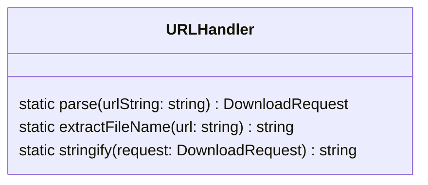

```mermaid
classDiagram
  class URLHandler {
    static parse(urlString: string) DownloadRequest
    static extractFileName(url: string) string
    static stringify(request: DownloadRequest) string
  }
```
